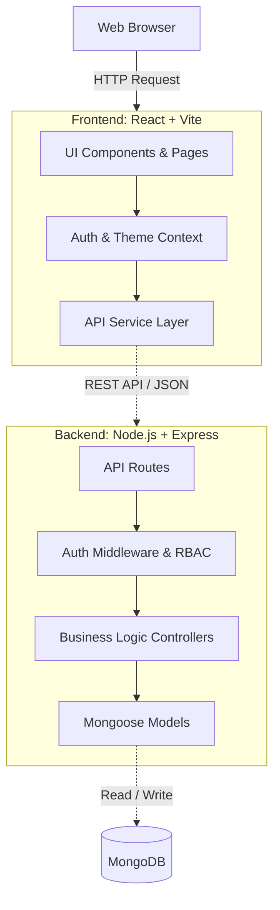

# 🚀 Gigflow — Smart Leads Dashboard

> A premium, full-stack MERN lead management dashboard featuring a dark, Growaz-inspired UI with Framer Motion animations and Three.js backgrounds. Features robust JWT authentication, Role-Based Access Control (RBAC), advanced lead filtering, server-side pagination, and CSV exports.

## 🛠️ Tech Stack

### Frontend
- **Framework:** React 19, TypeScript, Vite
- **Styling:** Tailwind CSS v4, custom shadcn-style UI components
- **Animations & Visuals:** Framer Motion, React Three Fiber (Three.js)
- **State Management:** React Context API, Custom Hooks

### Backend
- **Server:** Node.js, Express.js, TypeScript
- **Database:** MongoDB, Mongoose ODM
- **Authentication:** JSON Web Tokens (JWT), bcrypt

### DevOps
- **Containerization:** Docker, Docker Compose

---

## 🏗️ Architecture



---

## 📁 Project Structure

```text
Gigflow/
├── backend/                # Express API Backend
│   ├── src/
│   │   ├── config/         # DB & Environment configs
│   │   ├── controllers/    # Request handlers & logic
│   │   ├── middleware/     # JWT Auth, error handling
│   │   ├── models/         # Mongoose schemas (User, Lead)
│   │   ├── routes/         # API endpoints
│   │   ├── types/          # TypeScript definitions
│   │   ├── utils/          # Helpers (ApiError, ApiResponse)
│   │   └── validators/     # Zod validation schemas
│   ├── Dockerfile
│   └── package.json
├── frontend/               # React Vite Frontend
│   ├── public/             # Static public assets
│   ├── src/
│   │   ├── assets/         # Images, SVG icons, base CSS
│   │   ├── components/     # Reusable UI building blocks
│   │   │   ├── landing/    # Marketing/Landing page specific
│   │   │   ├── layout/     # Navbars, Sidebars, Backgrounds
│   │   │   ├── leads/      # Lead Tables, Forms, Filters
│   │   │   └── ui/         # Core UI (Buttons, Inputs, Cards)
│   │   ├── context/        # React Providers (Auth, Theme)
│   │   ├── hooks/          # Custom Hooks (useLeads, useDebounce)
│   │   ├── lib/            # Utility functions
│   │   ├── pages/          # Full page views mapped to Routes
│   │   ├── services/       # Axios API integration
│   │   └── types/          # Frontend interfaces
│   ├── Dockerfile
│   └── vite.config.ts
├── docs/                   # Documentation
│   ├── API.md              # Detailed API endpoint reference
│   └── ASSIGNMENT_CHECKLIST.md # Requirements tracking
└── docker-compose.yml      # Orchestration
```

---

## ✨ Key Features

- **Stunning Landing Page**: Growaz-inspired UI with smooth Framer Motion entry animations and a 3D particle background.
- **Secure Authentication**: User registration and login utilizing HTTP JWT strategies.
- **Role-Based Access Control (RBAC)**: Differentiated permissions for **Admin** (can delete leads) and **Sales** (can only manage their leads).
- **Comprehensive Lead Management**: Full CRUD operations for leads.
- **Advanced Filtering & Search**: Filter by status and source; combined with a 400ms debounced search by name or email.
- **Server-Side Pagination**: Efficiently loads 10 records per page to ensure fast performance at scale.
- **CSV Export**: Instantly export your current filtered lead view to CSV format.
- **Dark Mode**: Toggleable dark mode providing an elegant, distraction-free environment.

---

## 🚀 Quick Start (Local Development)

### Prerequisites

- Node.js 20+
- MongoDB running locally (or use Docker for MongoDB only)

### 1. Backend Setup

```bash
cd backend
cp .env.example .env
npm install
npm run dev
```

### 2. Frontend Setup

```bash
cd frontend
cp .env.example .env
npm install
npm run dev
```

Open http://localhost:5173 to view the app in your browser!

### Seeded Accounts (when `SEED_DEMO_DATA=true`)

| Role | Email | Password |
|------|-------|----------|
| Admin | `admin@gigflow.com` | `Admin@123456` |
| Sales | `sales@gigflow.com` | `Sales@123456` |

*18 demo leads are inserted on the first run (skipped if leads already exist). Register more users via `/register`.*

---

## 🐳 Docker Deployment

The fastest way to get everything running at once!

```bash
cp .env.example .env
# Edit JWT_SECRET in .env
docker compose up --build
```

- Frontend: http://localhost
- API: http://localhost:5000/api
- MongoDB: localhost:27017

---

## ⚙️ Environment Variables

### Backend (`backend/.env`)

| Variable | Description |
|----------|-------------|
| `NODE_ENV` | `development` or `production` |
| `PORT` | API port (default `5000`) |
| `MONGODB_URI` | MongoDB connection string |
| `JWT_SECRET` | Secret for signing JWTs |
| `JWT_EXPIRES_IN` | Token expiry (e.g. `7d`) |
| `CORS_ORIGIN` | Allowed origins (comma-separated) |
| `SEED_ADMIN_EMAIL` | Optional admin seed email |
| `SEED_ADMIN_PASSWORD` | Optional admin seed password |

### Frontend (`frontend/.env`)

| Variable | Description |
|----------|-------------|
| `VITE_API_URL` | API base URL (e.g. `http://localhost:5000/api`) |

---

## 📜 Documentation & Scripts

- **[Assignment Checklist](docs/ASSIGNMENT_CHECKLIST.md)**
- **[API Reference](docs/API.md)**

| Location | Command | Description |
|----------|---------|-------------|
| backend | `npm run dev` | Dev server with hot reload |
| backend | `npm run build` | Compile TypeScript |
| frontend | `npm run dev` | Vite dev server |
| frontend | `npm run build` | Production build |

## 📄 License

MIT
